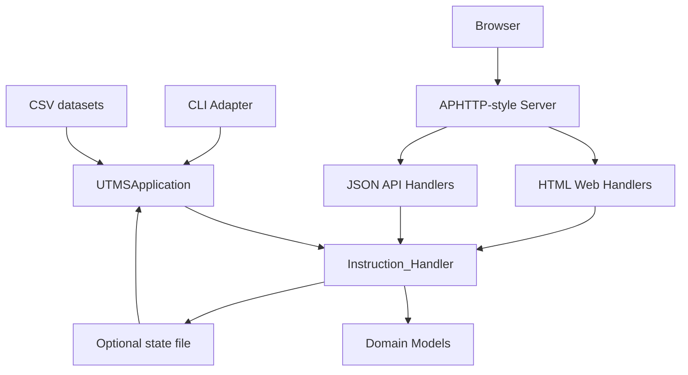

# University Teaching Management System (UTMS)

> Advanced Programming (AP) – University of Tehran – Department of Electrical & Computer Engineering**

    

## Overview

This repository contains the source code for **UTMS**, a university teaching management and social-media platform implemented in **C++20**. It was developed as the *Sixth Computer Assignment* for the *Advanced Programming* course at the **University of Tehran**.

The system combines a simplified educational management service with a social network. Students, professors, and the default university account can authenticate, publish posts, connect with each other, receive notifications, manage course offerings, enroll in courses, use teaching-assistant workflows, and interact with course announcement channels.

The project includes both the original command-line interface required by the assignment and a full graphical web interface powered by a lightweight APHTTP-style server.

## Project Objectives

- ✅ **University course management:** Create course offerings, enforce prerequisites, verify major eligibility, prevent schedule/exam conflicts, and manage student enrollment.
- ✅ **Social-media layer:** Publish personal posts, connect users bidirectionally, browse personal pages, and receive chronological notifications.
- ✅ **Teaching-assistant workflow:** Professors can publish TA forms, students can submit requests, and professors can accept or reject applicants.
- ✅ **Course announcement channels:** Each course offering has a dedicated channel where professors and accepted TAs can post announcements.
- ✅ **Complete web interface:** Browser-accessible pages provide graphical forms for the normal workflows, so regular usage no longer requires the CLI.
- ✅ **Stable backend:** The web server includes request/response logging, socket timeouts, safer request parsing, upload validation, and RAII-managed request handling.
- ✅ **Showcase features:** Optional state persistence, JSON API routes, screenshots, documentation pages, and demo assets are included for a stronger GitHub presentation.

## System Architecture & Phases

The project follows the three phases of the original assignment series.

### 1️⃣ Phase 1: Core UTMS Engine

- Load students, professors, majors, and courses from CSV datasets.
- Let the system manager create course offerings.
- Let students enroll in and drop course offerings after all eligibility checks.
- Let users publish posts, connect to each other, browse pages, and receive notifications.

### 2️⃣ Phase 2: Extended Academic Features

- Course announcement channels for every offering.
- Profile photos and post images.
- TA forms created by professors.
- TA requests submitted by students.
- Accept/reject workflow for applicants.
- Accepted TAs gain course-channel access.

### 3️⃣ Phase 3: Web Interface

- `/` provides the UTMS login page.
- `/home` shows a role-aware dashboard.
- Students can enroll, drop, view registered courses, browse channels, and request TA positions.
- Professors can publish channel posts, create TA forms, review applicants, and close TA forms.
- The system manager can create new course offerings from a graphical form.
- Ordinary users can publish posts with PNG images, manage profile photos, browse personal pages, connect to users, and read notifications.

The web interface delegates to the same `Instruction_Handler` business rules used by the CLI, keeping behavior consistent across interfaces.

## Screenshots

<p align="center">
  
  
  
</p>

<p align="center">
  
  
  
</p>

## Project Structure

The project is organized as follows:

```text
UTMS/
├── data/                                 # Default CSV datasets used by demo/test commands
│   ├── data_courses.csv                  # Sample course dataset
│   ├── data_majors.csv                   # Sample major dataset
│   ├── data_professors.csv               # Sample professor dataset
│   └── data_students.csv                 # Sample student dataset
├── docs/                                 # Project documentation
│   ├── assignments/                      # Original AP assignment PDFs
│   │   ├── APS03-A6.1-Description.pdf    # Phase 1 assignment description
│   │   ├── APS03-A6.2-Description.pdf    # Phase 2 assignment description
│   │   └── APS03-A6.3-Description.pdf    # Phase 3 assignment description
│   ├── api-routes.md
│   ├── architecture.md
│   ├── cli-commands.md
│   ├── screenshots.md
│   ├── state-persistence.md
│   └── testing.md
├── includes/                             # Header files
├── includes/                             # Header files
│   ├── app_controller.hpp                # Application-level wrapper
│   ├── class_*.hpp                       # Domain models
│   ├── handler_instruction.hpp           # Business-rule dispatcher
│   ├── io_*.hpp                          # CSV and terminal I/O
│   ├── server.hpp                        # APHTTP-style server interface
│   ├── web_handlers.hpp                  # HTML and JSON API handlers
│   └── ...
├── sources/                              # C++20 implementation files
│   ├── main.cpp                          # CLI/Web startup mode selection
│   ├── handler_instruction.cpp           # UTMS command execution
│   ├── io_terminal.cpp                   # Terminal command parser
│   ├── io_csv.cpp                        # Dataset reader
│   └── ...
├── utils/                                # Original APHTTP utility mirror
├── web/                                  # Static assets, favicon, and runtime uploads
│   ├── UTMS.png                          # Transparent UTMS logo asset
│   ├── login.html                        # Login page style reference
│   └── uploads/                          # Runtime PNG uploads
├── screenshots/                          # README preview screenshots
│   ├── login-dark.png
│   ├── login-light.png
│   ├── dashboard-dark.png
│   ├── dashboard-light.png
│   ├── post-details-dark.png
│   └── post-details-light.png
├── scripts/                              # Automated smoke/regression tests
├── tests/                                # CLI smoke input/expected output
├── Makefile                              # Build, test, format, lint, sanitizer targets
├── LICENSE                               # MIT License
└── README.md                             # Project documentation
```

## Architecture Diagram



More details are available in [`docs/architecture.md`](./docs/architecture.md).

## Setup & Verification

Built with **C++20** for Linux environments.

### 1. Install dependencies

```bash
sudo apt-get update
sudo apt-get install build-essential make curl
```

Optional development tools:

```bash
sudo apt-get install clang-format clang-tidy
```

### 2. Build

```bash
make clean && make
```

The phase-three executable is generated as:

```bash
./out.utms
```

A compatibility symlink named `utms.out` is also created.

### 3. Run in terminal mode

```bash
./out.utms data/data_majors.csv data/data_students.csv data/data_courses.csv data/data_professors.csv --cli
```

### 4. Run in web mode

```bash
./out.utms data/data_majors.csv data/data_students.csv data/data_courses.csv data/data_professors.csv --web
```

Then open:

```text
http://localhost:5000
```

A custom port can be selected with:

```bash
./out.utms data/data_majors.csv data/data_students.csv data/data_courses.csv data/data_professors.csv --web --port 8080
```

### 5. Optional state persistence

```bash
./out.utms data/data_majors.csv data/data_students.csv data/data_courses.csv data/data_professors.csv --web --state state/local.utms-state
```

or:

```bash
UTMS_STATE_FILE=state/local.utms-state ./out.utms data/data_majors.csv data/data_students.csv data/data_courses.csv data/data_professors.csv --web
```

See [`docs/state-persistence.md`](./docs/state-persistence.md).

## Testing and Quality

Run the full test suite:

```bash
make test
```

Individual scripts:

```bash
./scripts/run_smoke_tests.sh
./scripts/run_cli_regression_tests.sh
./scripts/run_web_smoke_tests.sh
```

The web regression test covers login, authorization, API routes, PNG upload, enrollment, request/response logging, and optional state persistence.

Additional development targets:

```bash
make sanitize   # AddressSanitizer + UndefinedBehaviorSanitizer build
make format     # clang-format, if installed
make lint       # clang-tidy, if installed
```

## JSON API Preview

The web server also exposes a small REST-like JSON API:

```text
POST /api/login
POST /api/logout
GET  /api/me
GET  /api/users
GET  /api/user?id=<user_id>
GET  /api/courses
GET  /api/notifications
```

See [`docs/api-routes.md`](./docs/api-routes.md) and [`demo/api-demo.sh`](./demo/api-demo.sh).

## Web Workflow Coverage

The web UI contains dedicated pages for the operations required in phase three:

- Login/logout and role-aware dashboard
- Create social posts with optional PNG images
- Save/delete profile photos
- View course offerings with table filtering
- Search and display personal pages
- Enroll/drop/view courses as a student
- Create course offerings as the system manager
- Browse course channels and read channel posts
- Publish course-channel posts as a professor or accepted TA
- Create, request, review, and close TA forms
- Connect to users and read notifications

## Implementation Notes

- Command arguments are order-independent after `?`, as required by the assignment.
- Personal posts and course posts are displayed newest-first where the specification requires timeline ordering.
- Course offerings are stored in a `deque` so object addresses remain stable when new offerings are added.
- The login page intentionally does not expose privileged manager credentials.
- Web requests are checked against the active session cookie before serving dashboard/action pages.
- Session cookies use `HttpOnly`, `SameSite=Lax`, and `Path=/`.
- Uploaded PNG files are validated by signature and stored under `web/uploads/`.
- User-generated content is HTML-escaped in pages and JSON-escaped in API output.
- The HTTP server logs requests/responses by default and redacts password/cookie fields.
- Socket I/O timeouts and `SIGPIPE` handling reduce the chance of idle browser connections blocking or crashing the server.

HTTP logging can be disabled for a quieter run:

```bash
UTMS_HTTP_LOG=0 ./out.utms data/data_majors.csv data/data_students.csv data/data_courses.csv data/data_professors.csv --web
```

## Documentation

- [`docs/architecture.md`](./docs/architecture.md)
- [`docs/api-routes.md`](./docs/api-routes.md)
- [`docs/cli-commands.md`](./docs/cli-commands.md)
- [`docs/testing.md`](./docs/testing.md)
- [`docs/state-persistence.md`](./docs/state-persistence.md)
- [`docs/screenshots.md`](./docs/screenshots.md)

## Author

Developed as a University of Tehran Advanced Programming course project by:

- **[Meraj Rastegar](https://github.com/mragetsars)**

## License

This project is licensed under the **MIT License**. See [`LICENSE`](./LICENSE) for details.
