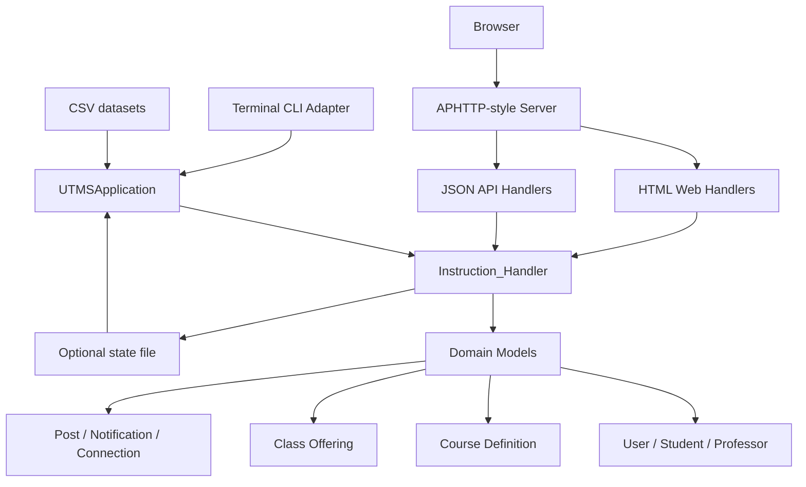

# UTMS Architecture

UTMS is organized as a small layered C++20 application. The original assignment required the business logic to be reusable between CLI and Web interfaces; this repository keeps the same principle.

## Layers

### Domain layer

The domain layer contains the entities and rules that model the assignment:

- `User`, `Student`, `Professor`, and `System_Manager`
- `Class` for course offerings and course channels
- posts, notifications, TA forms, enrollments, connections, profile photos, and channel posts

### Application layer

`UTMSApplication` owns the main `Instruction_Handler`, configures optional persistence, and gives CLI/Web adapters a single application entry point.

### Interface adapters

- `io_terminal.*` parses and executes assignment-style commands.
- `web_handlers.*` renders HTML pages, validates uploads, exposes JSON API routes, and delegates business rules to `Instruction_Handler`.
- `server.*` is the lightweight APHTTP-style HTTP server.

## Important design choices

- Course offerings are stored in a `deque` so pointers from students, professors, and forms remain stable after new offerings are created.
- UI and API routes call the same command dispatcher used by the CLI, keeping behavior consistent across interfaces.
- Web file uploads are stored under `web/uploads/` and served through `/asset` to keep filename handling centralized.
- Optional state persistence is deliberately simple and human-readable so it does not interfere with the original CSV-based assignment workflow.
